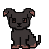

# ProDOGtivity Pet

A CEN3101 Project by Urmi Thorat, Yanna Lin, Michael Cardei, and Saketh Renangi, with updates being maintained by Yanna Lin

## Description 
The pandemic has led to a higher dependence and use of online learning. This unprepared shift in the education system has created challenges. One of these challenges includes decreased student engagement. Productivity Pet provides a solution to this issue.

The Productivity Pet is a Canvas-integrated desktop pet application that helps students with schedule management and staying productive. The software displays on a desktop screen as a desktop pet, with additional functionality. The pet sits on top of a clock, allowing a user to keep track of time. By pressing the _Options_ button, each user can view their individual Canvas assignments, input additional assignments manually, and set reminders for themselves.

## Getting Started
Begin by cloning this repository onto a personal device or downloading the zipped files. We recommend setting up a Python virtual environment in your downloaded project in order to maintain separation of necessary dependencies and ensure differences in versions don't cause errors down the line. Then, you can install the packages outlined in the requirements.txt folder. These required packages can be installed using the command `pip install -r requirements.txt`.

The desktop pet software is activated by running the Pet.py file within the pet directory. Once the pet appears on the desktop monitor, press the _Options_  button. In doing so, an Options window will appear on the screen. Inputting a personal Canvas API key and pressing the _Connect to Canvas_ produces the dialogue on the IDE or terminal used to run Productivity Pet. More information on creating a Canvas API key can be found below. By providing responses to the prompts in the command line, a user's course and assignment data will be saved. The name inputted by the user during this point can be used at a future point for logging into the pet and accessing the assignment/task list.  The _Options_ button also allows for users to manually input tasks, create reminders, change the pet’s appearance, and print sorted tasks. Pressing the button labeled _Exit_ will quit the software.

## Creating a Canvas API Key
1. Log into your institution's Canvas web page.
2. Click on your profile in the upper left corner and select _Settings_.
3. Press the _+ New Access Token_ button and input   Productivity Pet   in the   Purpose   text edit. Leave _Expiration_ blank.
4. Copy the provided API key for use in the Productivity Pet.

## Contributions. 
Pull requests are welcome. For major changes, please open an issue first to discuss what you would like to change.

Please make sure to update tests as appropriate. Currently, tests are found in the   Backend  directory. 

## Credits
Basic animations and sprites from The Nobody on https://medium.com/analytics-vidhya/create-your-own-desktop-pet-with-python-5b369be18868.

  

## License
[MIT](https://choosealicense.com/licenses/mit/)
